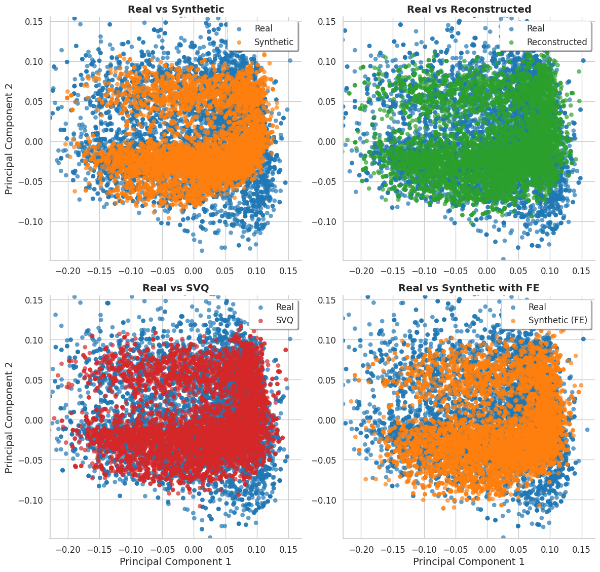
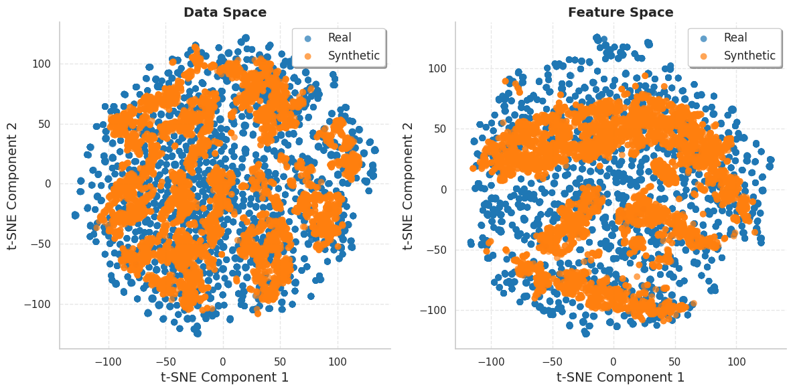

# T-VQ-VAE-TrajGen: TimeVQVAE for Synthetic Aircraft Trajectories

This repository contains the implementation code for a paper titled "Generating Synthetic Aircraft Trajectories Using Time-Based Vector Quantized Variational Autoencoders", which is currently under review.

## Note

The code in this repository is associated with ongoing research and a paper that is currently in the review process. As such, it is subject to changes and updates.


## Usage
 
The following are the general instructions for running the code in this repository:

### Environment Setup

This project uses [Poetry](https://python-poetry.org/) for dependency management. To install Poetry, run the following command:

```bash
curl -sSL https://install.python-poetry.org | python -
```

After installing Poetry, navigate to the project directory and run the following command to install the dependencies:

```bash
poetry install
```

To activate the virtual environment, run the following command:

```bash
poetry shell
```

We use the `pyproject.toml` file to manage the project dependencies and scripts. The `pyproject.toml` file contains the project’s metadata and dependencies. The `scripts` section in the `pyproject.toml` file is used to define the scripts that are available in the project’s virtualenv. For example:

```toml
[tool.poetry.scripts]
[tool.poetry.scripts]
train = "timevqvae.scripts.train:main"
train_fcn = "timevqvae.scripts.train_fcn:main"
evaluate = "timevqvae.scripts.evaluate:main"
evaluate_flyability = "timevqvae.scripts.evaluate_flyability:main"
generate = "timevqvae.scripts.generate:main"
preprocess = "timevqvae.scripts.preprocess:main"
```
Here, we will have the `preprocess`, `train`, `generate`, `evaluate`, and `evaluate_flyability` scripts available in the virtualenv after installing the package. When a script is added or updated, run `poetry install` to make them available in the project’s virtualenv. To run a script, use the command `poetry run <script_name>`, or activate the virtualenv and run `<script_name>`.


### Project Structure

```
TimeVQVAE                           # Root directory
├── configs                         # Configuration files for the models and training
│   └── config.yaml                 # Main configuration file for the project
├── pyproject.toml                  # Poetry configuration file
├── README.md                       # Project README file
├── Makefile                        # Makefile for running the project scripts
├── timevqvae                       # Main package directory
│   ├── evaluation                  # Directory for evaluation scripts and metrics
|   │   ├── flyability_eval.py      # Flyability evaluation script
│   │   ├── flyability_utils        # Utility functions for flyability evaluation
│   │   ├── eval_utils.py           # Utility functions for evaluation
│   │   ├── metrics.py              # Metrics for evaluating generated time series
│   │   ├── rocket_functions.py     # ROCKET (Random Convolutional Kernel Transform) functions
│   │   └── stat_metrics.py         # Statistical metrics for evaluation
│   ├── generation                  # Directory for generation scripts
│   │   └── sampler.py              # Sampling logic for generating new time series
│   ├── models                      # Directory for the model architectures
│   │   ├── bidirectional_transformer.py  # Bidirectional transformer model
│   │   ├── fcn.py                  # Fully Convolutional Network model
│   │   ├── fidelity_enhancer.py    # Fidelity enhancement model
│   │   ├── maskgit.py              # MaskGIT model implementation
│   │   ├── vq.py                   # Vector Quantization module
│   │   └── vq_vae.py               # Vector Quantized Variational Autoencoder model
│   ├── scripts                     # Directory for main execution scripts
│   │   ├── evaluate.py             # Script for evaluating the generated time series
│   │   ├── evaluate_flyability.py  # Script for evaluating the flyability of generated trajectories
│   │   ├── generate.py             # Script for generating new time series
│   │   ├── preprocess.py           # Script for preprocessing the input data
|   |   ├── preprocess_landing.py   # Script for preprocessing the landing trajectories
│   │   ├── train_fcn.py            # Script for training the FCN model
│   │   └── train.py                # Main training script for TimeVQVAE
│   ├── trainers                    # Directory for training logic
│   │   ├── stage1.py               # Stage 1 training logic
│   │   ├── stage2.py               # Stage 2 training logic
│   │   └── stage3.py               # Stage 3 training logic
│   └── utils                       # Directory for utility functions
│       ├── data_utils.py           # Utility functions for data processing
│       ├── plot_utils.py           # Utility functions for plotting
│       ├── sample_utils.py         # Utility functions for sampling
│       └── train_utils.py          # Utility functions for training
├── deployment                      # Directory for deployment scripts        
│   ├── app.py                      # Streamlit app for serving the model
│   ├── pages                       # Directory for Streamlit app pages
│   ├── README.md                   # Deployment README file
│   ├── serve.py                    # Script for running the LLM server
│   └── utils                       # Directory for utility functions for streamlit app deployment
└── tests                           # Directory for tests (to be implemented)
```


### Data preprocessing

```bash
# Amsterdam to Milan
preprocess --ADEP EHAM --ADES LIMC --raw_data_dir ../raw_data/ --data_source OpenSky --save_dir ./data/real/

# Oslo to Rome
preprocess --ADEP ENGM --ADES LIRF --raw_data_dir ../raw_data/ --data_source OpenSky --save_dir ./data/real/
```

### Training

```bash
train --config configs/config.yaml --dataset_file data/real/OpenSky_EHAM_LIMC.pkl --model_save_dir saved_models
```


### Generation

```bash
 generate --config configs/config.yaml --dataset_file data/real/OpenSky_EHAM_LIMC.pkl --model_save_dir saved_models --synthetic_save_dir data/synthetic --synthetic_fidelity_dir data/synthetic_fidelity
```

### Evaluation

```bash
evaluate --config configs/config.yaml --dataset_file data/real/OpenSky_EHAM_LIMC.pkl --model_save_dir saved_models 
```

## Makefile

We added a `Makefile` to simplify the workflow. The `Makefile` provides a complete pipeline from data preprocessing to training, generation, and evaluation. The `Makefile` contains the following targets:

- `all`: The default target that checks for trained models, data, and runs the generation script.
- `generate`: Runs the generation script after checking for trained models.
- `evaluate`: Runs the evaluation script after checking for trained models.
- `train`: Runs the training script after checking for the data file.
- `preprocess`: Runs the data preprocessing script.

The `Makefile` also includes a `help` target that provides information on how to use the Makefile and the available targets. The `Makefile` uses variables to set the departure airport (`ADEP`), arrival airport (`ADES`), and data source (`DATA_SOURCE`). These variables can be set when running the Makefile to specify the airports and data source for the data preprocessing, training, generation, and evaluation steps. Example usage of the Makefile:

```bash
make ADEP=EHAM ADES=LIMC DATA_SOURCE=EuroControl # Run the complete pipeline with specified airports and data source

make preprocess ADEP=EHAM ADES=LIMC DATA_SOURCE=EuroControl # Run data preprocessing with specified airports and data source

make train ADEP=EHAM ADES=LIMC DATA_SOURCE=EuroControl # Run training with specified airports and data source, preprocess data if needed

make generate ADEP=EHAM ADES=LIMC DATA_SOURCE=EuroControl # Run generation with specified airports and data source, train if needed

make evaluate ADEP=EHAM ADES=LIMC DATA_SOURCE=EuroControl # Run evaluation with specified airports and data source, train if needed
```

## Evaluation plots

To interactively visualize the evaluation plots, see the notebooks in the `notebooks` directory

1- [pca_tsne.ipynb](notebooks/pca_tsne.ipynb): Plotting the Principal Component Analysis (PCA) and t-distributed Stochastic Neighbor Embedding (t-SNE) plots for the generated trajectories vs. the real trajectories.


<table>
  <tr>
    <td style="text-align:center;">
        
        <p style="text-align:center;">PCA Plot</p>
    </td>
    </tr>
</table>

<table>
  <tr>
    <td style="text-align:center;">
        
        <p style="text-align:center;">t-SNE Plot</p>
    </td>
    </tr>
</table>
